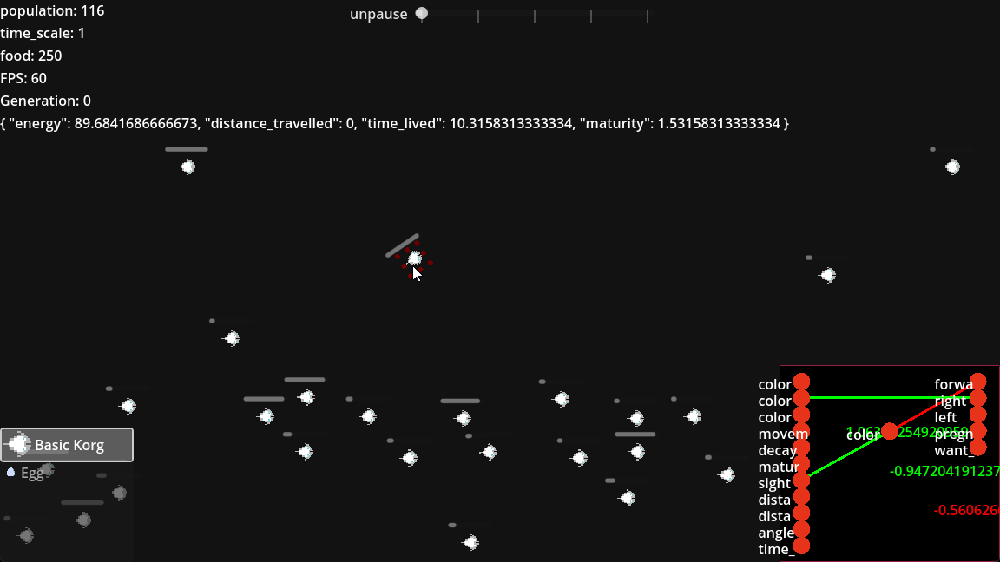

# Neat4Godot

Neat4Godot is an implementation of the NEAT (NeuroEvolution of Augmenting Topologies) algorithm for the Godot game engine. NEAT is a powerful algorithm for evolving artificial neural networks, often used in reinforcement learning and evolutionary robotics scenarios.


example image from a game I'm working on

This addon provides the tools and framework to integrate NEAT-based AI into your Godot projects, allowing you to create adaptive and evolving game characters, agents, and more. With Neat4Godot, you can harness the power of genetic algorithms to train AI entities within your games.

## Features

- **NEAT Algorithm:** Neat4Godot implements the NEAT algorithm, which is known for evolving neural network topologies over generations.

- **Flexible Integration:** Easily integrate Neat4Godot into your existing Godot projects to add evolving AI behaviors.

- **Customizable Neural Networks:** Define the structure of neural networks for your AI agents, specifying the number of inputs, hidden layers, and outputs.

- **Population Management:** Manage populations of AI agents, evolve neural networks, and evaluate their performance in your game environments.

- **Real-Time Learning:** Watch your AI characters adapt and improve in real time as they interact with your game world.

## Usage

To use Neat4Godot in your Godot project, follow these simple steps:

1. **Install the Addon:** Download the Neat4Godot addon and place it in your project's `addons` directory.

2. **Enable the Addon:** In the Godot editor, go to `Project` > `Project Settings` > `Plugins`, and enable the Neat4Godot plugin.


## QuickStart

```swift
# flappy bird neural net example
var input_size = 3 # distance to next pipe, height of bird, distance to floor
var output_size = 1 #jump up
var neat = Neat.new(input_size, output_size, 100) # 100 agents in population

# Creating genome
var genome = neat.empty_genome()
var client = Client.new()
client.genome = genome

neat.clients.add(client)

# calculating output based on inputs
var outputs = client.calculate([X,  Y, Z]) # distance to next pipe, height of bird
# distance to floor
# do something with outputs, maybe jump or stop jumping
# TODO

```
Actual graphics need to be created manually. This library is only responsible for the Neural Network that defined movements. 

## Example Projects

**Coming Soon**

## License

Neat4Godot is distributed under the [MIT License](LICENSE), which means you are free to use and modify it in your own projects. However, please attribute the addon if you find it useful.

## Contributing

Contributions to Neat4Godot are welcome! If you'd like to improve the addon, fix bugs, or add new features, please fork the repository and submit pull requests.

## Support

If you have any questions, issues, or need assistance with Neat4Godot, you can:

- [Open an Issue](https://github.com/skynse/neat4godot/issues) on GitHub for bug reports and feature requests.
- Join the [Godot Community](https://community.godotengine.org/) for discussions and help from fellow developers.
- Visit the [Godot Engine Official Website](https://godotengine.org/) for general information about the Godot game engine.

Happy evolving with Neat4Godot!
